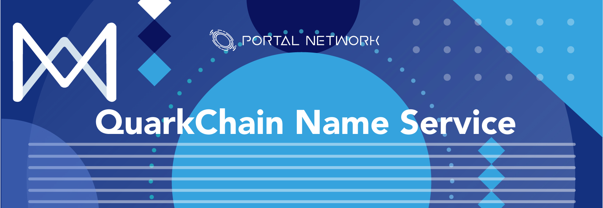
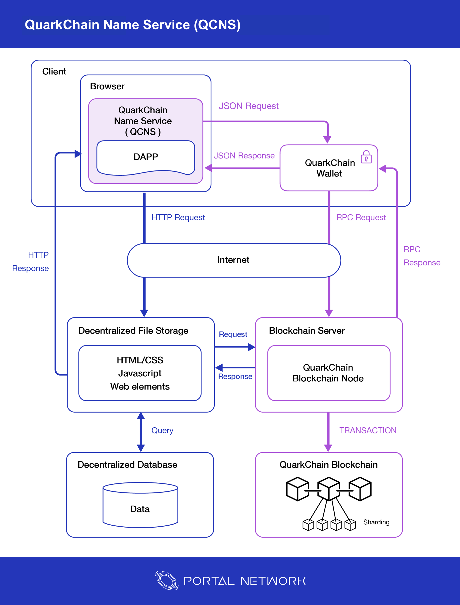
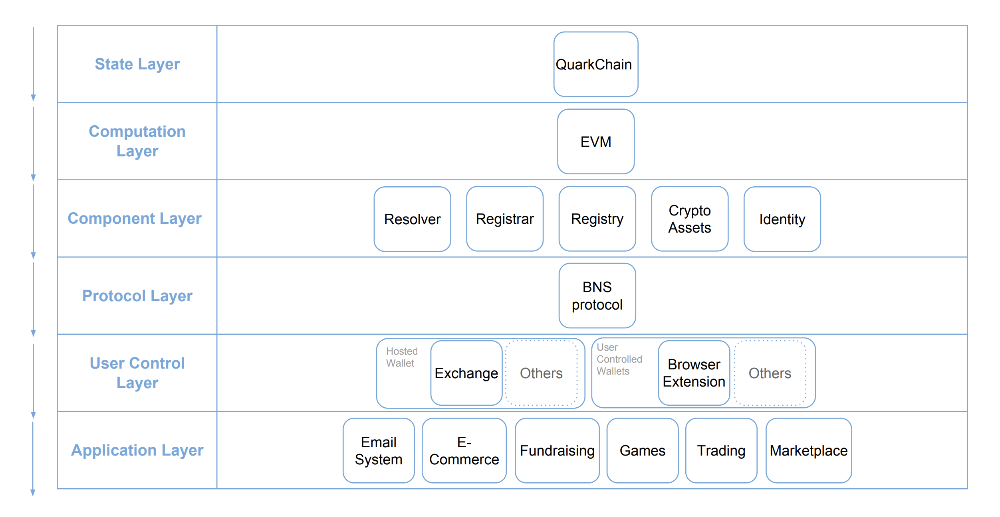
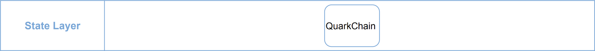
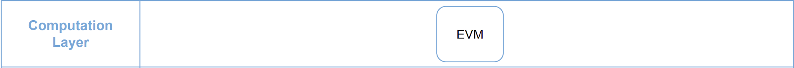
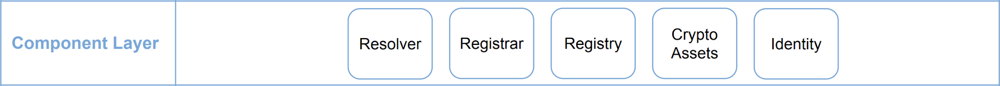
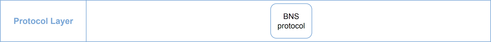
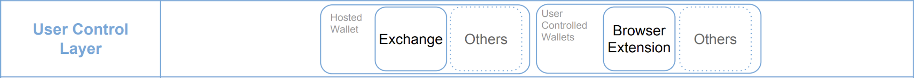
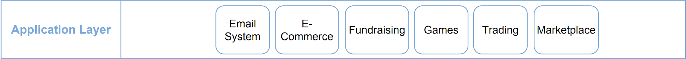

> 📖🔍 Documents of the QuarkChain Name Service.

## 💡 What is QuarkChain?
QuarkChain is a secure, permission-less, scalable, and decentralized blockchain. One of the goals of QuarkChain is to utilize sharding technology to deliver over 1 million transactions per second (tps). Essentially, QuarkChain markets itself as a peer-to-peer blockchain with a high capacity throughput to help deliver fast and secure decentralized applications.

## 💡 What is BNS?
BNS – or blockchain name system – is the protocol on the internet that turns human-comprehensible decentralized website names such as ‘website.perl’ or ‘mywebsite.eth’ into addresses understandable by decentralized network machines.

## 📝 Description

QCNS is the QuarkChain Name Service, a distributed, open, and extensible naming system based on the QuarkChain blockchain.

## 📚 Documents

#### Table of Contents
-  [Introduction](./docs/INTRODUCTION.md)
-  [Implementation](./docs/IMPLEMENTATION.md)
    - [Registry](./docs/REGISTRY.md)
    - [Registrar](./docs/REGISTRAR.md)
    - [Resolver](./docs/RESOLVER.md)
-  [Integration](./docs/INTEGRATION.md)

## 📝 Guideline
- [Smart Contract Deploy](./docs/SMART_CONTRACT_DEPLOY.md)
- [Smart Contract Testing](./qcns/README.md)
- [Smart Contract Design Principle](./docs/SMART_CONTRACT_DESIGN_PRINCIPLE.md)

## Testnet Contract
| Network    | Contract Name | Contract address                                   | Transaction hash
|------------|---------------|----------------------------------------------------|---------------------
| Testnet    | QCNS Registry | [0xa8ba7b969Fd1f4f5172C4cfeBaaDc78a12483F65f05d8fc2](http://testnet.quarkchain.io/address/0xa8ba7b969Fd1f4f5172C4cfeBaaDc78a12483F65f05d8fc2) | [0x47162f71e12173451c1b62662d28cad72bc0e8bbbc9e63c540c1589d4d0e73d7f05d8fc2](http://testnet.quarkchain.io/tx/0x47162f71e12173451c1b62662d28cad72bc0e8bbbc9e63c540c1589d4d0e73d7f05d8fc2)
| Testnet    | QCNS Registrar | [0xc24D4c1D4efB55E7bb78682CE3d2c41a62dF62bBf05d8fc2](http://testnet.quarkchain.io/address/0xc24D4c1D4efB55E7bb78682CE3d2c41a62dF62bBf05d8fc2) | [0x92220064d636f5600744fa9eb0c561ef8272fa0a248f9efcaeda49c8fbb6675cf05d8fc2](http://testnet.quarkchain.io/tx/0x92220064d636f5600744fa9eb0c561ef8272fa0a248f9efcaeda49c8fbb6675cf05d8fc2)
| Testnet    | QCNS Resolver | [0xb14Fe7658E16c845B65FE848b602d78d94F7493df05d8fc2](http://testnet.quarkchain.io/address/0xb14Fe7658E16c845B65FE848b602d78d94F7493df05d8fc2) | [0x77d883b1e52f4c18361ddf38d939d2e809dea8e89f74b5a3428cea1749a43452f05d8fc2](https://testnet.quarkchain.io/tx/0x77d883b1e52f4c18361ddf38d939d2e809dea8e89f74b5a3428cea1749a43452f05d8fc2)

## 📝 QCNS in Web3.0
QCNS plays an connecting and entry layer in Web3.0 services. It connects with QuarkChain wallet, blockchain server, decentralized content resources, and decentralized database.


## QuarkChain Technical Stack
QuarkChain is a high-throughput blockchain that aims to achieve hundreds of thousands TPS (Transaction per Second) through the sharding technology. It is designed to provide secure, decentralized, and scalable solution for future dApps. QuarkChain Name Service (QCNS) will be built upon QuarkChain that will interact with each of its stack layer differently.


### State Layer
State layer is where QuarkChain's user “state”, or user information and behavior, is stored. It is where users have the ability to control their own state.


### Computation Layer
QuarkChain uses EVM (Ethereum Virtual Machine) in its computation layer, which is responsible for executing complicated calculations. It is in charge of managing, checking the code of smart contract on QuarkChain. For instance, when a transaction occurs, the logic designed in EVM will determine its path that cannot be altered, making the smart contracts on QuarkChain immutable and temper-proof. Portal Network will be deploying QCNS (Smart Contract Standard) on this layer that consists 3 major components.


### Component Layer
The design of digital assets can have more functions through combing the State Layer and Computation Layer, such as : crypto assets, and identities. Those programmable assets has many more potential usages and sub-economies within. QCNS includes three major component: a `registry`, a `registrar`, and a `resolver`.

A `registry` component stores all the information relative to a domain, and can operate the set of logics to map between the QuarkChain domains and its owners.
A `registrar` component governs the domain purchase through the customized auction or trading rules.
A `resolver` component processes the corresponding resources from wallet address to decentralized application or website on QuarkChain.


### Protocol Layer
On the Protocol Layer, we will be presenting our BNS (Blockchain Name Service) standards that can make the QCNS more efficient and applicable. This layer integrate the logic behind QCNS (computation layer and component layer), and presents a gateway for users and developers to use and interact.


### User Control Layer
User control layer is in charge of managing private keys to communicate with the state layer. QCNS is completely decentralized, and governed by smart contracts, which allows users to have full control over their domains. Users can control, set up, and manage their digital asset with an easier and readable text.


### Application Layer
QCNS can be easily implemented into any of the services or application on QuarkChain who wish to make decentralized user experience better. For instance, wallet that can resolve QCNS will allow users to easily send or receive QuarkChain Token (QKC); dApp that utilize QCNS will enable users to have their own digital identity that are more meaningful and valuable. We believe that QCNS is an essential components to provide a better environment for both technical and non-technical users. 


## ⚙️ QCNS smart contract test coverage
__Continuous updating__
- [Coverage Report](./tns/coverage/)

```
Launched testrpc on port 8555
Running: truffle test
(this can take a few seconds)...
Using network 'development'.


  Contract: QCNS
    ✓ should allow registration of names (96ms)
    ✓ should register a domain (122ms)
    ✓ should check resolver interfaces (103ms)
    ✓ should not support a random interface
    ✓ should set resolver for node (139ms)
    ✓ should set text (197ms)
    ✓ should set address (179ms)
    ✓ should set multihash (187ms)


  8 passing (3s)

--------------------|----------|----------|----------|----------|----------------|
File                |  % Stmts | % Branch |  % Funcs |  % Lines |Uncovered Lines |
--------------------|----------|----------|----------|----------|----------------|
 contracts/         |       75 |       50 |       76 |     77.5 |                |
  QCNS.sol          |      100 |      100 |      100 |      100 |                |
  QCNSRegistrar.sol |      100 |       50 |      100 |      100 |                |
  QCNSRegistry.sol  |    78.57 |       50 |    77.78 |       80 |       68,69,96 |
  QCNSResolver.sol  |    66.67 |       50 |    69.23 |    68.42 |... ,98,129,140 |
--------------------|----------|----------|----------|----------|----------------|
All files           |       75 |       50 |       76 |     77.5 |                |
--------------------|----------|----------|----------|----------|----------------|

Istanbul coverage reports generated
Cleaning up...
Shutting down testrpc-sc (pid 87275)
Done.
```

## Resources
- [Official Website](https://quarkchain.io)
- [Testnet](https://testnet.quarkchain.io)
- [Developer API](https://developers.quarkchain.io/#introduction)

## 📣 Contributing
See [CONTRIBUTING.md](./CONTRIBUTING.md) for how to help out.

## 🗒 Licence
See [LICENSE](./LICENSE) for details.
