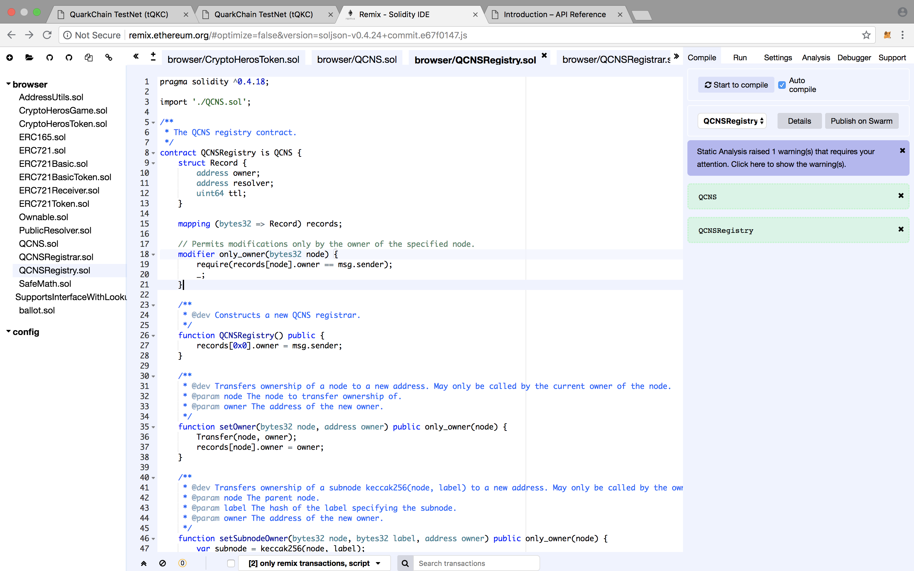
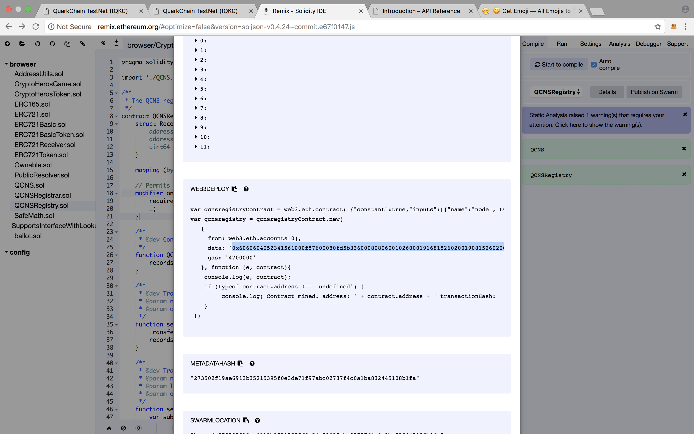
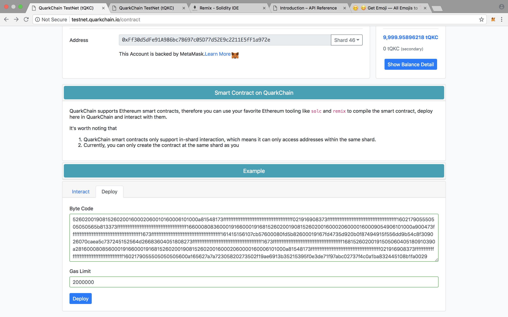
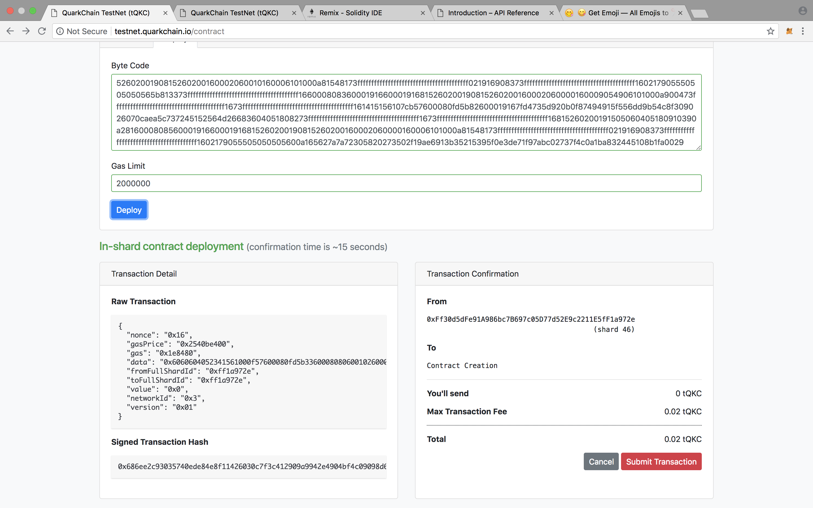
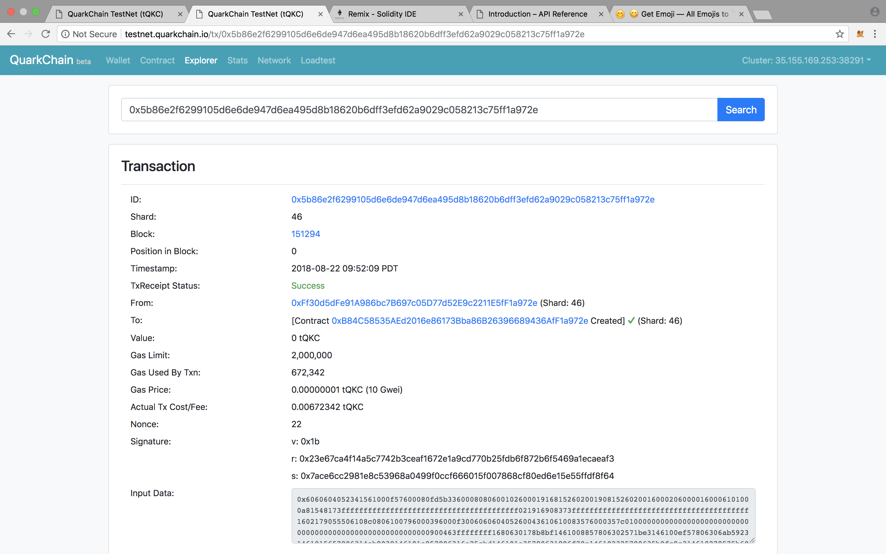

# Smart Contract Deploy

#### STEP 1. Using Remix to compile the smart contract to bytecode

We use the `QCNS.sol` and `QCNSRegistry.sol` for deploy.  
- URL: https://remix.ethereum.org

#### STEP 2. Copy the bytecode to the Quarkchain Contract

#### STEP 3. Deploy to the Quarkchain testnet 

Paste the bytecode to the "Byte Code" column.

#### STEP 4. Click Send Transaction

Use the MetaMask to sign the transaction and click the button to send the transaction

#### STEP 5. Check the transaction assoctiate with the smart contract

#### STEP 6. View the transaction hash for more detail

